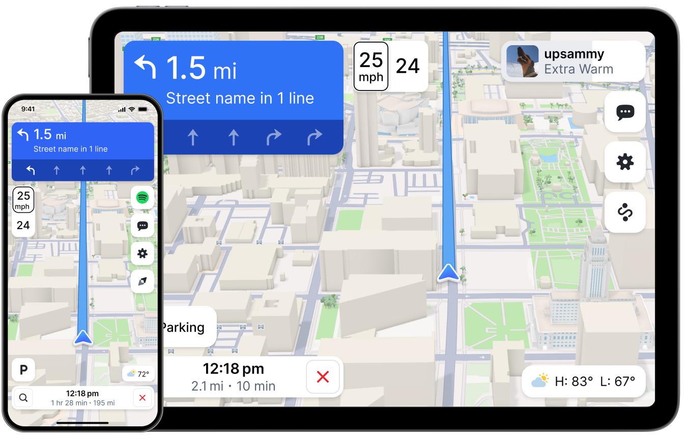

# Mapbox Dash Android SDK Examples

The repository is a collection of examples showing off the [Mapbox Dash Android SDK](https://docs.mapbox.com/android/dash).

<div align="center">
  
</div>

## Installation

Make sure you follow the steps under the [Installation](https://docs.mapbox.com/android/dash/guides/install/) guide. Once you have your **public and secret access tokens ready**, do the following:

### Build the project

1. `git clone git@github.com:mapbox/dash-android-examples.git`
2. Go to `app/src/main/res/values`
3. Look for `mapbox_access_token.xml`
4. If the file already exists, swap `YOUR_ACCESS_TOKEN_HERE` with your public access token.
5. If the file doesn't exist then create one and add the following content to it
   ```
   <?xml version="1.0" encoding="utf-8"?>
   <resources xmlns:tools="http://schemas.android.com/tools">
       <string name="mapbox_access_token">YOUR_ACCESS_TOKEN_HERE</string>
   </resources>
   ```
6. Ensure that your secret token is added to [settings.gradle.kts](settings.gradle.kts) or to global `gradle.properties` as described in the installation guide.
7. Run the examples under `app`.
